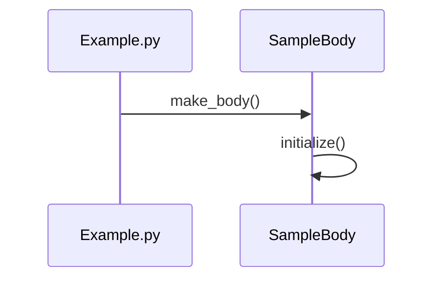

# Mermaid Jump

Use **Mermaid sequence diagrams as an entry point for code navigation** in VS Code.

No heavy parsers.
Designed specifically to **support code reading and understanding**, not full static analysis.

---

## Why Use This?

Before Mermaid Jump:

- ❌ Spend 30 minutes finding function definitions
- ❌ Get lost in 10,000+ line files
- ❌ Manually search for each function call

After Mermaid Jump:

- ✅ Click function → Instant jump to code
- ✅ See which functions are called most (color-coded)
- ✅ Understand code flow in 5 minutes

## ✨ Who This Is For

This extension is best suited for:

- Reading unfamiliar or legacy codebases
- Understanding execution flow before diving into implementations
- Using diagrams as a guide for where to start reading code

It is **not** intended to perfectly resolve all runtime behavior or dynamic dispatch.

## ✨ Features

- Jump to *related* function/method definitions from Mermaid sequence diagrams

  - When exact resolution is ambiguous, this extension prioritizes fast navigation over perfect accuracy
- Works inside Markdown, `.mmd`, and code comments
- Zero-config, instant response

---

## Design Philosophy

This project focuses on improving the *first 30 minutes* of code reading.

Instead of trying to fully understand a system automatically,
it helps developers quickly answer:

- Where does this flow start?
- Which functions are worth reading first?
- How does execution move across files?

## 🎥 Demo

### Quick Demo

### Step-by-Step Example

1. **Open your source file** (e.g., `Example.py`)
2. **Right-click → "Generate Sequence Diagram"** (via multilangSequence)
3. **Open the generated `.mmd` file**
4. **Click the preview button** in the top-right corner
5. **Click any function name** in the diagram to jump to its definition!

### Example Workflow

Click on `make_body()` or `initialize()` to navigate directly to the function definition.

### Features in Action

These features are designed to help you decide **what to read first**, not just where to jump.

- Zoom & Pan: Use toolbar buttons to navigate large diagrams
- Color Coding: Functions called frequently (5+) appear in orange, very frequent (10+) in red — helping highlight hotspots worth reading first
- Instant Navigation: Click-to-jump with no lag

---

## 🧩 How it Works

This extension intentionally avoids full AST or runtime analysis.
Instead, it relies on lightweight text-based heuristics to keep navigation fast and responsive.

### Generate Mermaid Sequence Diagrams

This extension is bundled with **multilangSequence**, which automatically generates Mermaid sequence diagrams from your code:
My extension focuses solely on navigation
diagram generation is delegated to multilangSequence

1. Open your source code (Python, TypeScript, Java, or JavaScript)
2. Right-click and select "Generate Sequence Diagram"
3. A `.mmd` file is created with the sequence diagram
4. Use this extension to jump from diagram to code

---

## 🚀 Usage

1. Right-click your function name in your code → "Generate Sequence Diagram" (via multilangSequence)
2. A `.mmd` file opens in the editor
3. Click the "Show Mermaid Preview" button in the top-right corner
4. The Mermaid sequence diagram is displayed in a webview panel
5. Click any function name in the diagram to jump directly to its definition

That's it.

> ⚠️ Note: This extension treats sequence diagrams as a **navigation index**, not a source of truth. Diagrams may be abstract or outdated, and this tool is designed to assist exploration rather than guarantee correctness.
