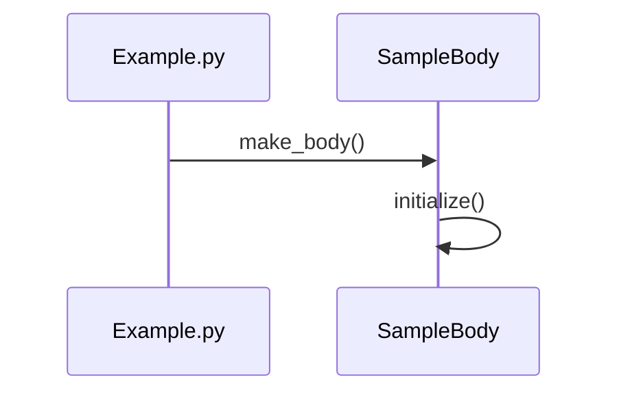

# Mermaid Jump

Jump from **Mermaid sequence diagrams → actual code** in VS Code.

No heavy parsers. No WASM.  
Just fast, lightweight navigation for code readers.

---

## ✨ Features

- Jump to function/method definitions directly from Mermaid sequence diagrams
- Works inside Markdown, `.mmd`, and code comments
- Zero-config, instant response

---

## 🎥 Demo

> Coming soon — jump from a Mermaid `sequenceDiagram` to your function.

---

## 🧩 How it Works

### Generate Mermaid Sequence Diagrams

This extension is bundled with **multilangSequence**, which automatically generates Mermaid sequence diagrams from your code:

1. **Open your source code** (Python, TypeScript, Java, or JavaScript)
2. **Right-click and select "Generate Sequence Diagram"**
3. A `.mmd` file is created with the sequence diagram
4. **Use this extension to jump from diagram to code** — click any function name in the diagram to navigate directly to its definition

### Example

Click `make_body()` or `initialize()` to jump to the corresponding function in your source code.

---

## 🚀 Usage

1. Right-click your function name in your code → "Generate Sequence Diagram" (via multilangSequence)
2. A `.mmd` file opens in the editor
3. Click the **"Show Mermaid Preview"** button in the top-right corner
4. The Mermaid sequence diagram is displayed in a webview panel
5. Click any function name in the diagram to jump directly to its definition

That's it.